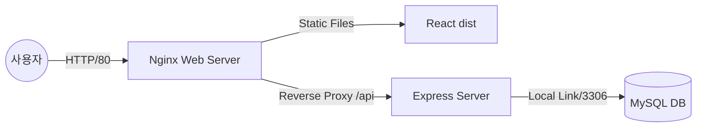

# Project Specification: Vibe Board (React + Vite + MySQL)

## 1. 개요 (Overview)
- **프로젝트 명**: Vibe Board
- **목적**: 프리미엄 디자인이 적용된 현대적인 CRUD 게시판 시스템 구축
- **기술 스택**:
    - Frontend: React 18, Vite, Axios, Vanilla CSS
    - Backend (참고): EC2 (Ubuntu/Linux), Node.js/Spring Boot (예정), MySQL
    - Communication: REST API (JSON)

## 2. 데이터 스키마 (Data Schema)
MySQL `boards` 테이블 구조:

| 필드명 | 타입 | 제약 조건 | 설명 |
| :--- | :--- | :--- | :--- |
| `id` | INT | PRIMARY KEY, AUTO_INCREMENT | 글 번호 |
| `title` | VARCHAR(255) | NOT NULL | 제목 |
| `content` | TEXT | NOT NULL | 내용 |
| `author` | VARCHAR(100) | NOT NULL | 작성자 |
| `created_at` | DATETIME | DEFAULT CURRENT_TIMESTAMP | 작성일 |

## 3. 기능 요구사항 (Functional Requirements)
- **전체 조회**: 서버로부터 모든 게시글 목록을 가져와 카드 또는 테이블 형태로 출력.
- **글번호 검색**: 특정 ID의 게시글 상세 정보 조회.
- **글 등록**: 제목, 내용, 작성자를 입력하여 새로운 게시글 추가.
- **글 수정**: 기존 게시글의 제목 및 내용 수정.
- **글 삭제**: 특정 게시글 삭제.
- **프리미엄 디자인**: 다크 모드, HSL 컬러 팔레트, 부드러운 호버 효과 및 마이크로 애니메이션 적용.

## 4. API 명세 (API Specification - Draft)
- `GET /api/boards`: 전체 목록 조회
- `GET /api/boards/:id`: 단일 항목 조회
- `POST /api/boards`: 신규 등록
- `PUT /api/boards/:id`: 수정
- `DELETE /api/boards/:id`: 삭제

---
*2026-04-20: 최초 작성 (Antigravity)*

## 5. Claude Code를 위한 상세 PRD (Refined for AI Agent)
이 섹션은 AI 에이전트(Claude Code)가 프로젝트를 이해하고 코드를 생성하는 데 필요한 기술적 세부 사항을 정의합니다.

### 5.1 컴포넌트 기능 명세
- **BoardList (메인 화면)**
    - 모든 게시글을 `GET /api/boards`를 통해 로드.
    - 검색창: 제목 또는 작성자로 필터링 (클라이언트 사이드 필터링 우선 적용).
    - 프리미엄 카드 레이아웃: 호버 시 부드러운 스케일 업 및 그림자 효과.
- **BoardDetail (상세 화면)**
    - `id` 파라미터를 사용해 `GET /api/boards/:id` 호출.
    - 게시글 내용 출력 시 `white-space: pre-wrap` 적용.
- **BoardForm (작성/수정)**
    - 유효성 검사: 제목(필수), 작성자(필수), 내용(최소 10자).
    - 성공 시 자동 목록 이동 (Navigate).

### 5.2 디자인 시스템 (Vibe Coding Guide)
- **Base Color**: Dark Background (`#0a0b10`), Primary Accent (`hsl(250, 100%, 70%)`).
- **Typography**: `Inter` 또는 `Outfit` 구글 폰트 사용.
- **Visual Effects**: 
    - Glassmorphism: `background: rgba(255, 255, 255, 0.03)`, `backdrop-filter: blur(12px)`.
    - Gradients: 선명한 색상보다는 부드러운 메시 그라디언트(Mesh Gradient) 권장.
- **Micro-interactions**: 버튼 클릭 시 스케일 감소(`scale(0.98)`), 데이터 로딩 시 스켈레톤(Skeleton) UI 제공.

---
## 6. 프로젝트 구현 현황 (2026-04-20 업데이트)

### 6.1 프론트엔드 인프라 구축
- **Vite 초기화**: React 18 기반 프로젝트 스캐폴딩 완료.
- **환경 변수 관리**: `.env` 파일을 통한 `VITE_API_URL` 설정 및 `axios.create()` 기반의 전역 API 인스턴스(`axiosInstance.js`) 구축.
- **라우팅**: `react-router-dom`을 적용하여 메인 목록(`/`), 글 등록(`/create`), 글 수정(`/edit/:id`) 경로 설정 완료.

### 6.2 Vibe Coding 디자인 시스템 적용
- **CSS 아키텍처**: `index.css`에 전역 디자인 토큰(HSL 컬러, 글래스모피즘 효과, 애니메이션 변수) 정의.
- **Layout 컴포넌트**: 스티키 헤더, 푸터, 그리고 프리미엄 그라디언트 로고가 포함된 공통 레이아웃 구현.
- **애니메이션**: 페이지 전환 및 데이터 로딩 시 `slide-up`, `fade-in` 마이크로 인터랙션 적용.

### 6.3 데모용 Mocking 시스템
- **Mock Data**: 백엔드 연동 전 UI 테스트를 위한 `mockData.js` 구축.
- **API Fallback**: `boardApi.js`에 시뮬레이션 지연 시간(`sleep`)과 함께 샘플 데이터를 반환하는 로직을 적용하여 오프라인 환경에서도 전체 CRUD 흐름 테스트 가능.

### 6.4 구현된 컴포넌트
- `BoardList`: 카드형 그리드 레이아웃, 실시간 클라이언트 사이드 검색 필터링.
- `BoardForm`: 등록/수정 공용 폼, 입력 유효성 검사 및 로딩 상태 처리.

### 6.5 Express 백엔드 및 EC2 연동 (신규)
- **서버 구축**: `server` 디렉토리에 Express 기반 API 서버 구축 완료.
- **DB 연동**: `mysql2/promise` 라이브러리를 사용하여 EC2 내 MySQL 데이터베이스와 연결.
- **환경 변수 분리**: 
    - 서버용 `.env`: `DB_HOST`, `DB_USER`, `DB_PASSWORD` 등 민감 정보 관리.
    - 프론트엔드 `.env`: `VITE_API_URL`을 통해 Express 서버와 통신.
- **RESTful API**: 게시판 CRUD를 위한 5가지 엔드포인트 구현 완료.

---
*2026-04-20: Express 백엔드 및 EC2 MySQL 연동 완료 (Antigravity)*
---
## 7. 최종 프로젝트 아키텍처 및 폴더 구조 (2026-04-20 완료)

### 7.1 시스템 아키텍처


### 7.2 상세 폴더 구조
```text
ex01/
├── server/                 # Express Backend
│   ├── index.js            # 서버 메인 로직 및 API 엔드포인트
│   ├── .env                # DB 접속 정보 (EC2 내부 보안 관리)
│   └── package.json        # 백엔드 의존성 (express, mysql2 등)
├── src/                    # React Frontend Source
│   ├── api/                # API 통신 모듈
│   │   ├── axiosInstance.js# Axios 인터셉터 및 설정
│   │   └── boardApi.js     # 게시판 CRUD 함수 정의
│   ├── components/         # 공용 컴포넌트 (Layout 등)
│   ├── features/           # 주요 기능별 컴포넌트 (BoardList, BoardForm)
│   ├── App.jsx             # 라우팅 및 전역 상태 관리
│   └── index.css           # Vibe Coding 디자인 시스템 (전역 스타일)
├── .env                    # 프론트엔드 환경 변수 (VITE_API_URL=/api)
└── Project_Specification.md# 프로젝트 상세 명세서
```

### 7.3 배포 환경 상세 (AWS EC2)
- **OS**: Ubuntu 24.04 LTS
- **Web Server**: Nginx (Reverse Proxy 설정)
- **Process Manager**: PM2 (백엔드 상시 가동)
- **Domain**: polar-bear.o-r.kr (DNS A Record 연결)
- **Database**: MySQL 8.0 (Port 3306, Private Access)

---
*2026-04-20: 전체 시스템 구축 및 도메인 배포 완료 (Antigravity)*
---
## 8. [프로젝트 설계 구조]

본 프로젝트는 서비스의 안정성과 확장성, 그리고 인프라의 핵심 동작 원리 이해를 목표로 설계되었습니다.

### 8.1 3-Tier 아키텍처 적용
시스템을 물리적/논리적으로 세 계층으로 분리하여 유지보수성을 극대화했습니다.
- **Presentation Tier**: React(Vite)를 사용한 클라이언트 환경. Nginx를 통해 정적 파일을 서빙합니다.
- **Application Tier**: Express(Node.js)를 사용한 비즈니스 로직 처리. RESTful API를 통해 클라이언트와 소통합니다.
- **Data Tier**: MySQL을 사용한 데이터 관리. 백엔드 서버와의 전용 연결을 통해 보안을 강화했습니다.

### 8.2 Nginx 리버스 프록시(Reverse Proxy) 전략
Nginx를 단순한 웹 서버를 넘어 **보안 관문(Gateway)**으로 활용합니다.
- **단일 엔드포인트**: 사용자는 80포트로만 접속하며, 내부 포트(8080, 3306)는 직접 노출되지 않아 보안이 우수합니다.
- **정적/동적 분리**: HTML/JS 파일은 Nginx가 즉시 처리하고, 데이터 요청(`/api`)만 백엔드로 전달하여 전체적인 성능을 최적화했습니다.

### 8.3 Native 설치 방식 채택 사유
본 배포 버전에서는 Docker 컨테이너 대신 OS(Ubuntu)에 직접 소프트웨어를 설치하는 **Native 방식**을 채택했습니다.
- **핵심 원리 학습**: 컨테이너의 추상화 없이 리눅스 환경 설정, 포트 포워딩, 서비스 데몬 관리 등 서버 인프라의 기본 원리를 완벽히 제어합니다.
- **리소스 최적화**: EC2 프리티어 환경에서 불필요한 레이어 없이 시스템 자원을 효율적으로 사용하여 응답 속도를 높였습니다.
- **PM2 프로세스 관리**: `vibe-backend` 프로세스를 PM2로 관리함으로써 서버 장애 시 자동 재시작 및 모니터링 체계를 구축했습니다.

### 8.4 향후 확장 계획
- **Dockerizing**: 각 계층을 컨테이너화하여 개발-테스트-배포 환경을 완벽히 일치시킬 예정입니다.
- **SSL/TLS 적용**: Certbot을 통한 HTTPS 보안 통신을 도입할 계획입니다.


### 추가 내용
#### 일반적으로 Native 방식을 사용하나요?
**네, 여전히 많이 사용합니다.** 특히 다음과 같은 경우에 Native 방식을 선택합니다.

- **학습 및 프로토타이핑**: Docker라는 추상화 계층 없이 OS의 동작 원리와 네트워크 설정을 직접 몸으로 배우기 위해 가장 먼저 하는 단계입니다. (사용자님은 오늘 그 핵심 원리를 완벽히 실습하신 거예요!)
- **단순한 서비스**: 리소스가 제한적인 저사양 서버(EC2 프리티어 등)에서는 Docker의 오버헤드조차 아쉬울 때 직접 설치하여 성능을 최대로 뽑아 쓰기도 합니다.
- **안정적인 구형 시스템**: 이미 안정적으로 돌아가고 있는 수많은 서버들이 여전히 Native 방식으로 운영되고 있습니다.


나: 지금 만든 프로젝트가 도커와 컨테이너를 사용해서 구현하면 오히려 성능이 떨어지거나 복잡해질 수 있다는 단점이 있는거지?

-> 네, 아주 날카로운 질문입니다! 결론부터 말씀드리면 "현재와 같은 소규모 단일 서버 환경에서는 그럴 수 있습니다."
구체적으로 어떤 면에서 그런지, 도커의 '트레이드 오프(Trade-off)' 관점에서 설명해 드릴게요.

- 1. 성능적인 측면 (리소스 효율성)
**미세한 오버헤드**: 도커는 가상머신(VM)보다는 훨씬 가볍지만, 결국 커널 위에서 컨테이너라는 가상화 계층이 하나 더 올라가는 셈입니다.
**저사양 서버의 한계**: 지금 사용 중인 **EC2 프리티어(t2.micro)**처럼 메모리가 1GB뿐인 아주 작은 서버에서는, 도커 엔진 자체의 메모리 점유율과 각 컨테이너가 사용하는 리소스가 때로는 부담이 될 수 있습니다. 직접 설치(Native)하면 이런 낭비 없이 서버 자원을 100% 우리 프로그램에 집중할 수 있죠.

- 2. 복잡성 측면 (설정의 번거로움)
**이중 관리**: 프로그램을 수정할 때마다 코드 수정 -> 이미지 빌드 -> 컨테이너 재시작이라는 과정을 거쳐야 합니다. 지금처럼 pm2 restart 한 번으로 끝나는 것보다 절차가 복잡해지죠.
**네트워크 설정**: 도커 내부 네트워크망과 외부 포트를 연결(Port Forwarding)하는 설정을 별도로 관리해야 합니다. 초보자들에게는 이 과정에서 연결이 끊기는 삽질(?)이 꽤 빈번합니다.
**데이터 보존(Volume)**: 도커는 컨테이너를 지우면 데이터도 날아가는 특성이 있어서, MySQL 데이터를 안전하게 보관하기 위해 '볼륨 매핑'이라는 설정을 따로 꼼꼼히 챙겨야 합니다.

- 3. 그럼에도 불구하고 왜 도커를 쓰나요?
이런 단점들에도 불구하고 팀 단위 개발이나 큰 서비스에서 도커를 쓰는 이유는 **"내 컴퓨터에선 되는데 서버에선 왜 안 되지?"**라는 문제를 100% 해결해주기 때문입니다.

- **현재 방식**: 서버를 옮길 때마다 "아, 아까 우분투에서 Nginx 어떻게 설치했더라? MySQL 비밀번호 뭐였지?" 하며 다시 똑같이 설정해야 함.
- **도커 방식**: docker-compose up 명령어 한 줄이면 지구 반대편 서버에서도 오늘 우리가 고생하며 만든 환경이 1초 만에 똑같이 복제됨.

-> 요약하자면
사용자님이 말씀하신 대로 **"지금처럼 작고 가벼운 프로젝트를 공부하며 빠르게 배포할 때"**는 Native 방식이 훨씬 성능적으로 유리하고 직관적입니다.

하지만 **"여러 명의 개발자가 협업하거나, 서버를 수십 대로 늘려야 할 때"**는 약간의 성능 저하를 감수하더라도 도커의 압도적인 편리함을 선택하게 되는 것이죠.
오늘 하신 작업은 "최소한의 비용으로 최대의 성능을 뽑아내는 실속형 배포"라고 생각하시면 됩니다!

---
*2026-04-20: 프로젝트 설계 구조 및 기술적 배경 명세 추가 완료 (Antigravity)*
