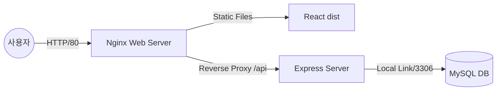

# 프로젝트 상세 명세서 — CodeTrip

> 현재 구현 상태 기준의 스냅샷 문서입니다.
> 날짜별 변경 이력은 [CHANGELOG.md](CHANGELOG.md)를 참고하세요.

---

## 0. 프로젝트 히스토리 및 개발 개요
본 문서는 프로젝트의 초기 설정부터 현재 `CodeTrip` 시스템으로 발전하기까지의 모든 과정을 기록합니다.

### 0.1 초기 테스트 (2026.04.16)
- **프로젝트명**: projecttest
- **목적**: 리액트 환경 테스트 및 인스타그램 스타일 카드 UI 구현 연습.
- **주요 성과**: ESLint 설정 고도화, JSX 문법 오류 해결, 랜덤 여행지 추천 로직(Ver.1) 구현.

---

## 1. 프로젝트 개요: CodeTrip
- **프로젝트 명**: CodeTrip (Vibe Board + Tour Info)
- **목적**: 프리미엄 디자인이 적용된 현대적인 CRUD 게시판 시스템 및 관광 정보 서비스 구축
- **현상태**: 현대적인 디자인(Glassmorphism, Code Vibe 컨셉)의 여행 정보 서비스 및 게시판 시스템 구축 중.

### 1.1 기술 스택 (Current)
- **Frontend**: React 19, Vite 8, Axios, Tailwind CSS v4 (`@tailwindcss/vite`), React Router DOM v7
- **Backend**: Node.js (Express), MySQL (AWS EC2 배포)
- **Infrastructure**: Nginx (Reverse Proxy), PM2
- **APIs**: 공공데이터포털 관광 정보 오픈 API (PhotoGalleryService1)
- **Linting**: ESLint 9.39.4 (Flat Config)

---

## 2. 시스템 상세 설계

### 2.1 게시판 시스템 (Board System)
- **데이터 구조**: MySQL `boards` 테이블 (id, title, content, author, created_at)
- **비즈니스 로직**:
    - **API 추상화**: `boardApi.js`를 통해 모든 HTTP 요청을 모듈화하여 관리.
    - **통합 폼 핸들링**: `BoardForm` 컴포넌트 하나에서 `isEdit` Props를 기반으로 수정(PUT)과 등록(POST) 로직을 유연하게 처리.
    - **상태 관리**: `useState`와 `useParams`를 활용하여 URL 기반의 게시글 상세 정보 페칭 및 동적 렌더링.

### 2.2 관광 정보 시스템 (Tourist Information)
- **실시간 데이터 페칭**: `useCallback` 기반의 비동기 함수로 한국관광공사 API 호출 최적화.
- **검색 및 필터링**: `searchTerm` 상태를 활용하여 제목(`galTitle`) 및 촬영 장소(`galPhotographyLocation`) 기준의 실시간 클라이언트 사이드 필터링 구현.
- **디자인 시스템**: 'Code Vibe' 컨셉에 맞춰 데이터 노출 영역에 Syntax Highlighting 스타일(Keyword, String, Comment 클래스) 적용.

### 2.3 프론트엔드 인프라 상세
- **Axios 고도화**:
    - `baseURL` 환경변수 처리 (`import.meta.env.VITE_API_URL`).
    - `Interceptor`를 통한 응답 에러 통합 로깅 및 `Promise.reject` 처리.
- **UI/UX**:
    - `animate-pulse`를 활용한 데이터 라이브 상태 표시기(`LIVE_DATA_FEED`).
    - `Aspect-video` 및 `Aspect-square` 비율을 활용한 반응형 이미지 레이아웃.
    - `Glassmorphism` 효과 및 다크/라이트 하이브리드 테마 적용.
    - 'Code Vibe' 컨셉의 Syntax Highlighting 스타일 UI 및 Glassmorphism 적용.

---

## 3. 시스템 아키텍처

- **아키텍처**: Frontend와 Backend가 분리된 3-Tier 구조(Nginx 리버스 프록시 활용).



### 3-Tier 아키텍처
- **Presentation Tier**: React(Vite) + Nginx 정적 파일 서빙
- **Application Tier**: Express(Node.js) RESTful API
- **Data Tier**: MySQL — 백엔드 전용 연결로 보안 강화

### Nginx 리버스 프록시 전략
- 사용자는 80포트로만 접속, 내부 포트(8080, 3306) 직접 노출 없음
- HTML/JS는 Nginx가 즉시 처리, 데이터 요청(`/api`)만 백엔드로 전달

### Native 설치 방식 채택 사유
- Docker 추상화 없이 리눅스 환경 설정, 포트 포워딩, 서비스 데몬 관리 등 서버 인프라 기본 원리 직접 제어
- EC2 프리티어 환경에서 불필요한 레이어 없이 시스템 자원 효율적 사용
- PM2(`vibe-backend`)로 프로세스 관리, 장애 시 자동 재시작

### 배포 환경 (AWS EC2)
- **OS**: Ubuntu 24.04 LTS
- **Web Server**: Nginx (Reverse Proxy)
- **Process Manager**: PM2
- **Domain**: polar-bear.o-r.kr (DNS A Record)
- **Database**: MySQL 8.0 (Port 3306, Private Access)

---

## 4. 데이터베이스 스키마

### boards 테이블

| 필드명 | 타입 | 제약 조건 | 설명 |
|--------|------|-----------|------|
| `id` | INT | PK, AUTO_INCREMENT | 글 번호 |
| `title` | VARCHAR(255) | NOT NULL | 제목 |
| `content` | TEXT | NOT NULL | 내용 |
| `author` | VARCHAR(100) | NOT NULL | 작성자 |
| `created_at` | DATETIME | DEFAULT CURRENT_TIMESTAMP | 작성일 |

---

## 5. API 명세

| Method | Endpoint | 설명 |
|--------|----------|------|
| GET | `/api/boards` | 전체 목록 조회 |
| GET | `/api/boards/:id` | 단일 항목 조회 |
| POST | `/api/boards` | 신규 등록 |
| PUT | `/api/boards/:id` | 수정 |
| DELETE | `/api/boards/:id` | 삭제 |

---

## 6. 구현 기능

### ==지역별/여행 테마별 여행지 + 기간별 지역 축제 소개==
- 여행지 상세 페이지(게시판 형식) + 여행 후기를 남길 수 있는 댓글 기능
- `react-router-dom`을 사용하여 각 여행지의 상세 정보를 보여주는 개별 페이지 구현
- 설명은 코드 주석처럼
- 여행지 상세 페이지에 지도 API 추가
    - **Kakao Maps API** 또는 **Google Maps API**를 연동하여 여행지의 위치를 마커로 표시
- 지역별(제주, 부산, 서울), 카테고리별(맛집, 명소, 숙소) **다중 필터**

### ==나의 여행 리스트(장바구니 형식으로) - 즐겨찾기 기능==
- **LocalStorage**를 활용해 브라우저를 새로고침해도 내가 즐겨찾기한 여행지가 유지되도록 구현

### ==날씨를 기준으로 여행지 랜덤 추첨==
- 지역 전체로 랜덤 추첨
- 지역으로 필터링된 여행지 추천 + 주변에 가볼 만한 곳

---

## 7. 환경변수

```
# .env (프론트엔드)
VITE_API_URL=/api
VITE_GALLERY_API_KEY=<공공데이터포털 인증키>

# server/.env (백엔드)
DB_HOST=<EC2 내부 주소>
DB_USER=<DB 사용자>
DB_PASSWORD=<DB 비밀번호>
```

---

## 8. 폴더 구조 (2026-04-21 기준)

- **구조**: `src/api` (통신 모듈), `src/features` (기능별 컴포넌트), `server/` (백엔드)로 역할이 명확히 분리됨.

```text
2_Code_Trip/
├── server/                       # Express Backend
│   ├── index.js
│   ├── .env
│   └── package.json
├── src/
│   ├── api/
│   │   ├── axiosInstance.js      # Axios 설정 (baseURL, Interceptor)
│   │   ├── boardApi.js           # 게시판 CRUD API 함수
│   │   └── mockData.js           # 테스트용 Mock 데이터
│   ├── components/
│   │   └── Layout/Layout.jsx
│   ├── features/
│   │   └── Board/
│   │       ├── BoardList.jsx
│   │       └── BoardForm.jsx
│   ├── pages/
│   │   └── TravelList.jsx        # 여행지 탐색 페이지 (신규)
│   ├── App.jsx                   # 메인(랜딩) 페이지
│   ├── App.css                   # 전역 스타일 (syntax 클래스, glassmorphism 등)
│   ├── main.jsx                  # BrowserRouter + Routes 설정
│   └── index.css                 # Tailwind 베이스 스타일
├── .env
├── tailwind.config.js            # 커스텀 컬러 토큰 + borderRadius
├── vite.config.js
└── 2_Project_Documents/
    ├── Project_Sketch.md         # 기획 초안
    ├── Project_Specification.md  # 현재 명세서 (이 파일)
    ├── CHANGELOG.md              # 날짜별 변경 이력
    └── DESIGN.md                 # 디자인 시스템
```

---

## 9. 향후 계획

### 현시점 주요 과제
- UI 디자인 통일성 확보 및 폴리싱.
- 외부 API(날씨, 지도) 연동 및 데이터 시각화.
- LocalStorage 기반 사용자 편의 기능(즐겨찾기) 구현.
- 날씨 기반 여행지 랜덤 추천 로직 정교화.

### 전체 로드맵
- UI 디자인 통일하기
- 날씨 / 지도 API 가져오기
- 날씨 기반 여행지 랜덤 뿌리기
- 데이터 관리 방식 결정
    - 사용자 입력 정보(게시판, 댓글, 회원 정보 등): MySQL로 관리 (도커 사용 X)
    - 관광 정보: 공공 Open API로 받아오기
        - Node.js로 API 호출 → MySQL 저장 스크립트
- 즐겨찾기 기능 구현 방법 결정
    - LocalStorage
    - 회원 관리 (회원에게만 제공되는 서비스 고민)
- 커뮤니티 기능 추가
- HTTPS + 로드밸런서 적용 (EC2)
- 도메인 배포

### 향후 확장 계획
- **Dockerizing**: 각 계층을 컨테이너화하여 개발-테스트-배포 환경 통일
- **SSL/TLS 적용**: Certbot을 통한 HTTPS 보안 통신 도입

---

*최종 업데이트: 2026-04-21*
